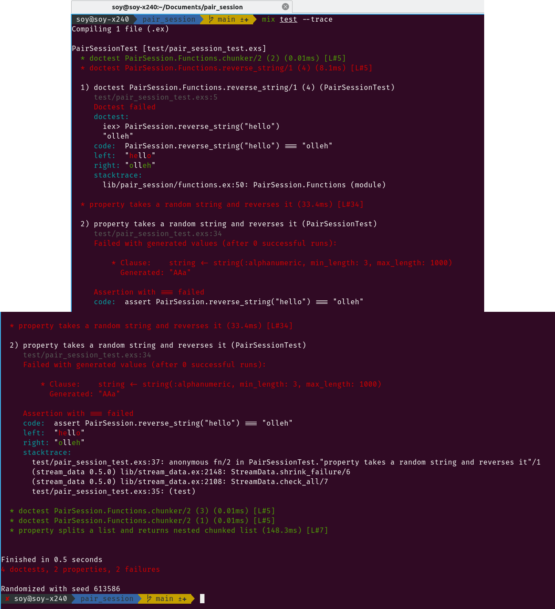

[//]: # "Badges"
[![Gitpod ready-to-code][gitpod badge]][gitpod]
[![Actions Status][actions badge]][actions]

[//]: # "Links"
[gitpod]: https://gitpod.io/#https://github.com/jaeyson/pair_session
[actions]: https://github.com/jaeyson/pair_session/actions

[//]: # "Image sources"
[gitpod badge]: https://img.shields.io/badge/Gitpod-ready--to--code-blue?logo=gitpod
[actions badge]: https://github.com/jaeyson/pair_session/workflows/Elixir%20CI/badge.svg

